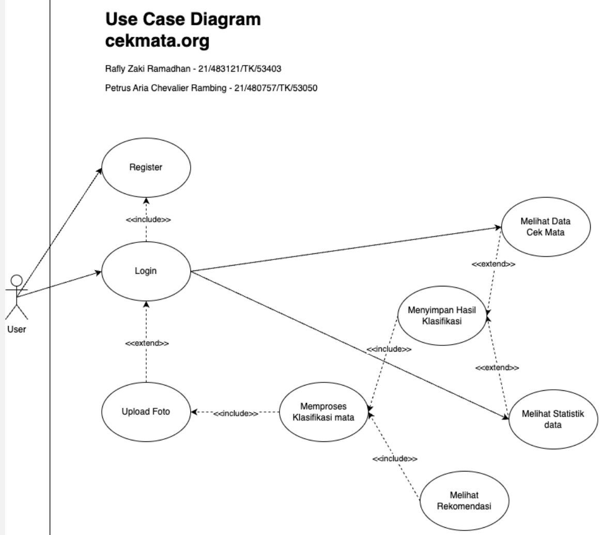
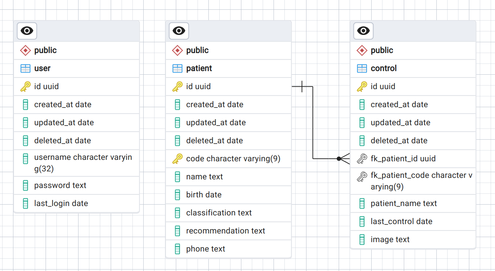
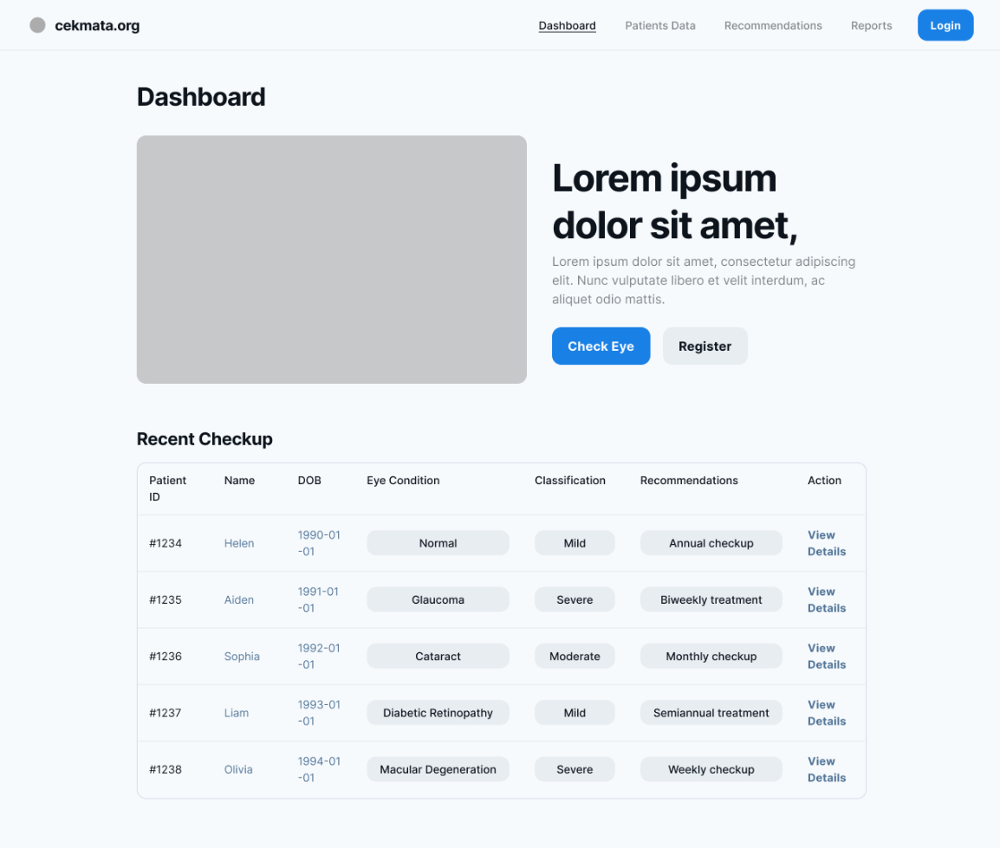
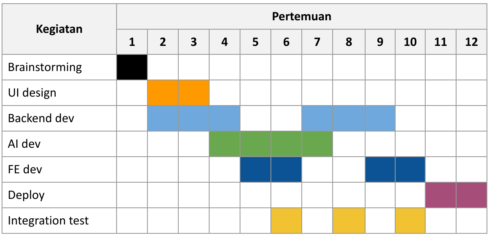

# **Modul 2**
[kembali ke halaman utama](./)

### **a. Tujuan dari produk**
1. Mendukung Deteksi Dini Gangguan Mata:
   1. Memberikan platform untuk mengunggah gambar mata guna mendeteksi dini gangguan kesehatan mata.
   2. Memungkinkan tindakan cepat dan pencegahan lebih efektif.
2. Memberikan Informasi dan Rekomendasi:
   1. Menyediakan penjelasan dan rekomendasi berdasarkan hasil klasifikasi gambar mata.
   2. Bertujuan memberikan pemahaman lebih baik tentang kondisi mata dan saran tindakan.
3. Pengembangan Model Machine Learning yang Akurat:
   1. Fokus pada pengembangan model machine learning yang akurat untuk meningkatkan keandalan hasil klasifikasi.
4. Kerjasama dengan Profesional Kesehatan Mata:
   1. Membangun kemitraan dengan profesional kesehatan mata untuk meningkatkan akurasi dan menyediakan jalur konsultasi lebih lanjut bagi pengguna.

### **b. Pengguna potensial dari produk dan kebutuhan para pengguna tersebut**
- Klinik kesehatan mata, rumah sakit

### **c. Use case diagram**
[draw.io](https://drive.google.com/file/d/1qgJR_n-O0blDBChE2GIXMHLxtyShG4Cz/view?usp=sharing)

### **d. Functional requirements untuk use case yang telah dirancang**
| FR | Deskripsi |
|-|-|
| Registrasi Pengguna | Pengguna harus dapat membuat akun baru untuk mengakses fitur-fitur aplikasi. Form Registrasi (nama, email, dan kata sandi.) dan  Verifikasi email |
| Login Pengguna | Pengguna yang sudah terdaftar harus dapat masuk ke dalam akun mereka. Formulir login dengan input email dan kata sandi serta autentifikasi jika diperlukan. |
| Mengunggah Gambar mata | Pengguna harus dapat mengunggah gambar mata untuk mendapatkan hasil klasifikasi. |
| Pengembangan ML | Model machine learning harus dikembangkan dan diperbarui untuk meningkatkan akurasi klasifikasi. |
| Rekomendasi Kondisi Mata | Pengguna harus menerima rekomendasi berdasarkan hasil klasifikasi gambar mata. Penjelasan yang jelas dan ringkas mengenai kondisi mata yang terdeteksi. Saran tindakan atau konsultasi lebih lanjut, jika diperlukan |
| Melihat Data Klasifikasi | Pengguna harus dapat melihat hasil klasifikasi gambar mata yang sudah diunggah |
| Melihat Statistik | Pengguna harus dapat melihat statistik terkait hasil klasifikasi dan kondisi mata |
| Kerjasama dengan Profesional Kesehatan Mata | Aplikasi harus menyediakan jalur untuk berkolaborasi dengan profesional kesehatan mata. (Formulir atau tautan untuk membuat janji konsultasi atau pemeriksaan mata) |

### **e. Entity relationship diagram**

### **f. Low-fidelity Wireframe**

### **g. Gantt-Chart pengerjaan proyek dalam kurun waktu 1 semester**
